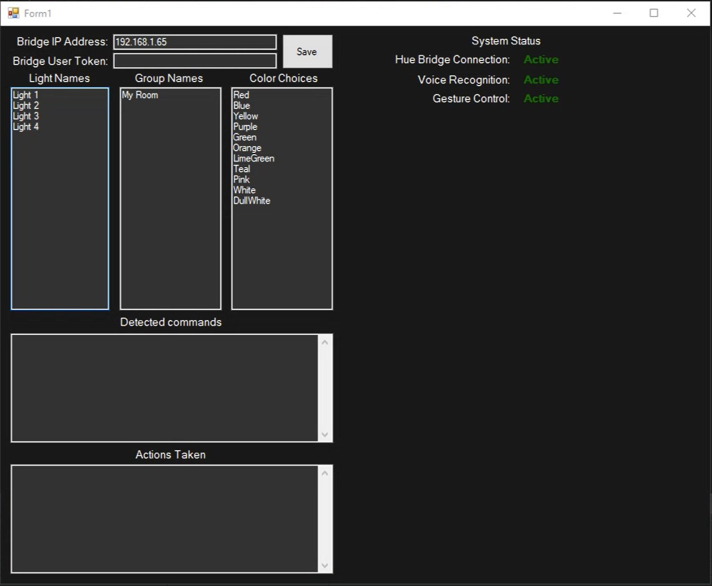

# C# Hue Voice & Gesture Controller
 This project was made with the goal of being able to control lights in a Hue light system using gestures and voice commands. The program uses the Kinect SDK 2.0 and Kinect V2 in order to handle the gestures. The program also uses Microsoft Speech Platform in order to enable voice commands.

## Dependencies
* [Kinect SDK 2.0](https://www.microsoft.com/en-us/download/details.aspx?id=44561)
* Microsoft Speech Platform SDK
  * *MicrosoftSpeechPlatformSDK.msi*
* Microsoft Speech Platform Runtime
  * *SpeechPlatformRuntime.msi*
* Microsoft Speech Language Recognizer
  * [MSSpeech_SR_en-US_TELE.msi](https://www.microsoft.com/en-us/download/details.aspx?id=24139)
* Microsoft Speech Language Synthesizer
  * [MSSpeech_TTS_en-US_Helen.msi](https://www.microsoft.com/en-us/download/details.aspx?id=24139)

*The download pages for the Speech Platform Runtime and SDK seem to not currently be available as of the time this README is being created.*

# The Application

##### Figure 1: Application Open

The GUI is built using Windows Forms and holds various controls for information about the system so the user can interact with it. 

## GUI Controls
* Bridge IP Address
  * Textbox for the ip address of the Hue bridge to be entered into
* Bridge User Token
  * Textbox for the user token(api key) for the bridge to be entered into
* Save
  * Button for saving the ip address and user token combo for connecting
* Light Names
  * Displays the names of all the lights returned by the bridge
* Group Names
  * Displays the names of all groups returned by the bridge
* Color Choices
  * These are colors that are availabe for voice commands. Only a few were implemented and specifying exact RGB values is not supported right now.
* Detected Commands
  * The application will show what voice command or gesture it has detected as well as the confidence level of the detection
* Actions Taken
  * The application will show what actions have been taken based on the detected voice/gesture commands. Actions are only taken when the confidenece level of the voice/gesture command is high enough. The confidence level needs to be greater than 50% in order to trigger an action.
* System Status
  * Shows if the bridge connection is active and whether or not the voice/gesture controls are active. (Figure 1 shows all active. User Token and Video feed have been hidden from the example picture)
* Video Feed
  * This is not shown in the figure 1 above. It is in the bottom right of the window and will show the video feed from the Kinect V2. 

   
# Obtaining Bridge IP & User Token
The Hue developers website provides a guide to obtaining the IP address of the bridge as well as getting a user token to use in the application. The guide can be viewed [here](https://developers.meethue.com/develop/get-started-2/).

# Gestures
The gestures are detected using a Kinect V2 and the SDK. The gestures were made using the Visual Gesture Builder and are contained in the hueGesture.gbd file. 

## Implemented Gestures
* Lights On
  * Start with hands open near hips
  * Bring hands up to chest with palms facing out infront of you
  * Close hands into a fist when reaching chest.
* Lights Off
  * Start with hands closed in a fist near hips
  * Brind hands up to chest with palms facing out infront of you
  * Open hands keeping palms facing out infront of you
* Color Cycle
  * Hands up near chest as a fist with palm facing out infront of you. Extend both pointer and middle finger upward.
  * Move hands sideways outward and bring them back inward.

# Voice Controls
The voice controls are done using the Microsoft Speech Platform. GrammarBuilders are used to build the voice commands in the application. 

## Commands
* Turn "lightname" on/off
  * Turns the specified light on or off
* Turn all on/off
  * Turns all lights on or off
* Change "lightname" color "colorname"
  * Turns the specified light to the specified color
* Change all lights color "colorname"
  * Turns all lights to the specified color
* Change "lightname" brightness "number 0-100" percent
  * Turns the brightness to the specified percentage value
* Change "lightname" saturation "number 0-100" percent
  * Turns the saturation to the specified percentage value
* Color cycle on/off
  * Turns the color cycle on or off
* Turn group "groupname" on/off
  * Turns the light in the specified group on or off
* Change group "groupname" color "colorname"
  * Turns the lights in the specified group to the specified color
* Change group "groupname" brightness "number 0-100" percent
  * Turn the lights brightness in the specified group to the specified value

All light names, group names and color choices are listed in the program upon running and connecting to the bridge.